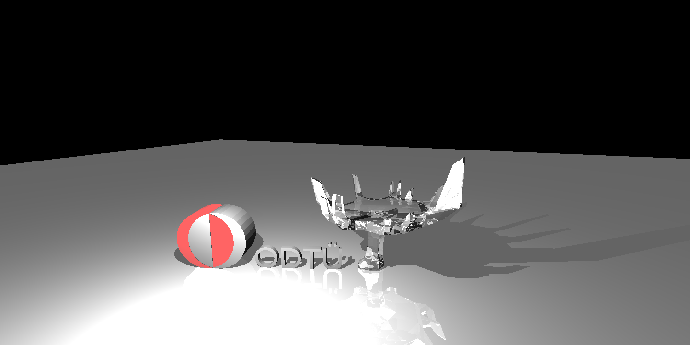
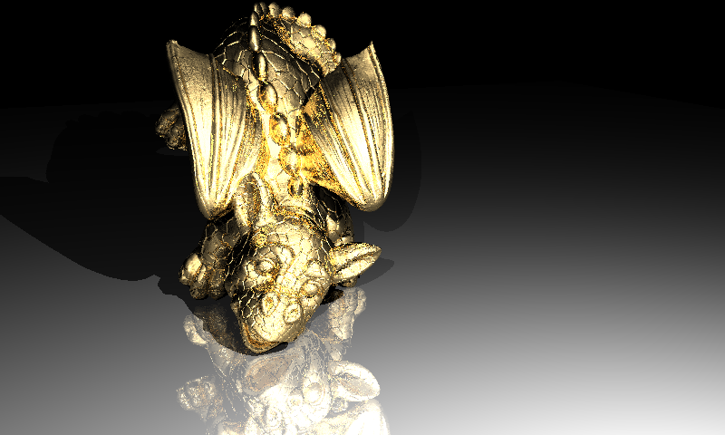
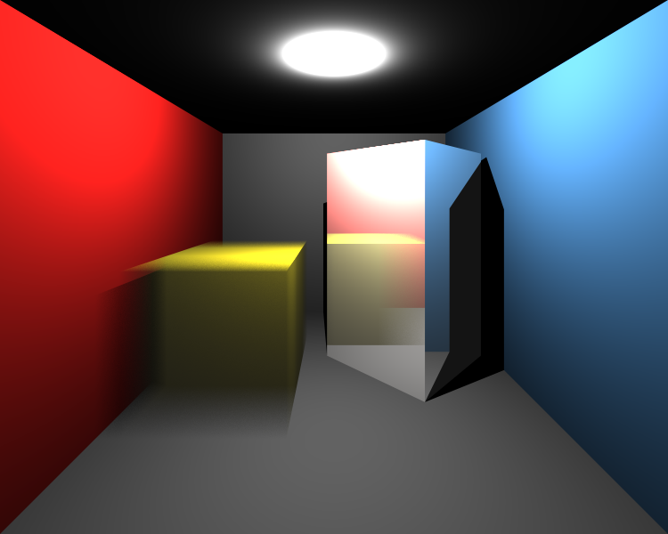
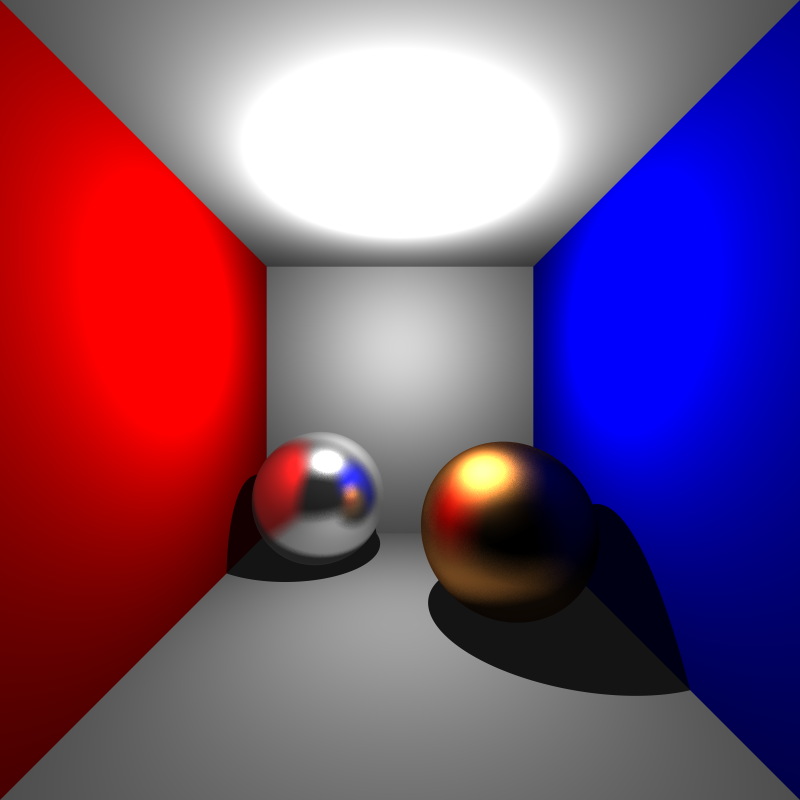
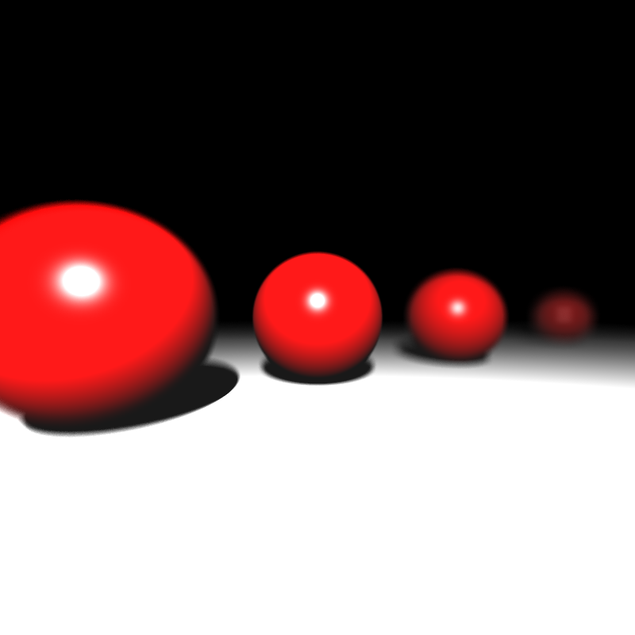
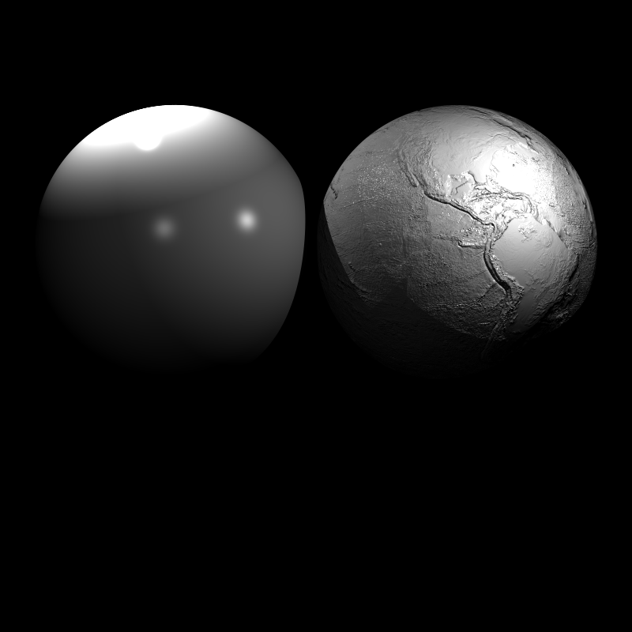
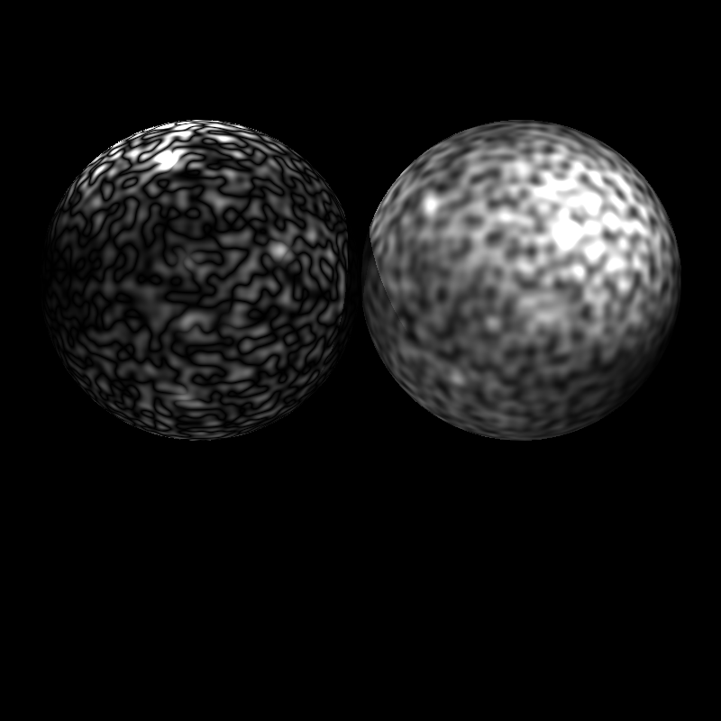
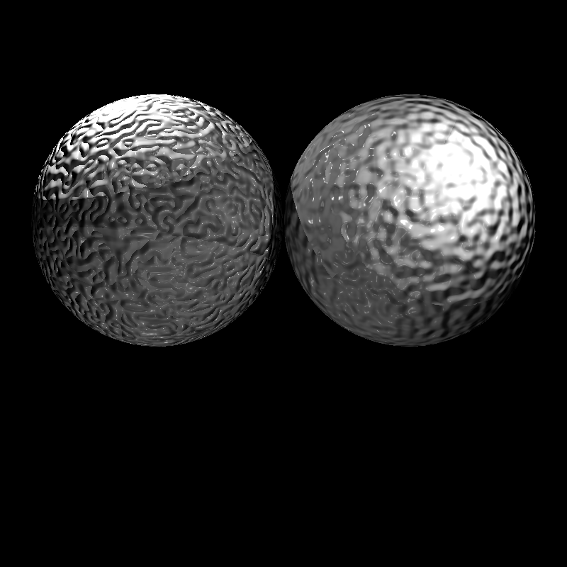
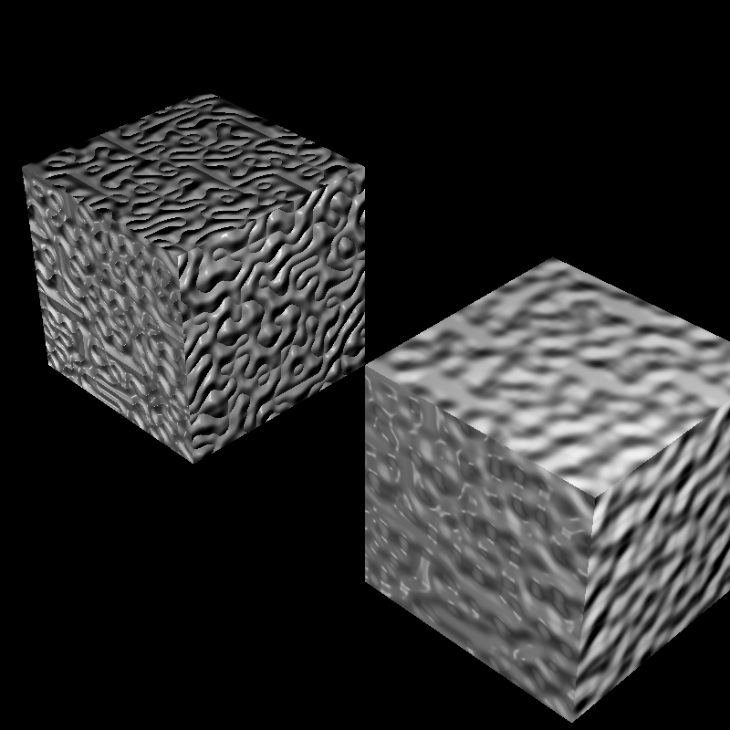
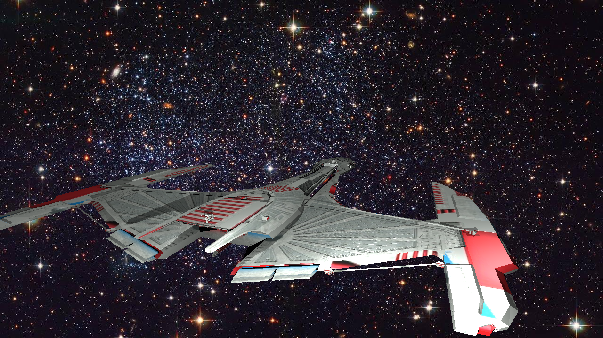

# Ray-Tracer

The full progress is published on the following blog: https://ac-raytracer.blogspot.com/

CPU Ray Tracer created from scratch with C++

It includes Acceleration Structures, Reflection, Refraction, Post-processing effects(Motion Blur, Glossy Reflections, Depth of Field), Texturemapping(image and generated), Tonemapping, and BRDFs.

In order to build, go to the src folder then use the following command on windows: g++ *.cpp -O3 -o raytracer, for linux use make command.

Run the exe with the path to scene given as argument-> executable_path scene_path
Windows: start raytracer scenes/example.xml Linux: ./raytracer scenes/example.xml

Scenes are included under <b>scenes</b> folder and their results can be found in the <b>results</b> folder.

<b>Some Example Results:</b>

<b>Recursive Raytracing</b>  

<b>Post-Processing Effect</b>  

<b>Texturing</b>  

<b></b>  
